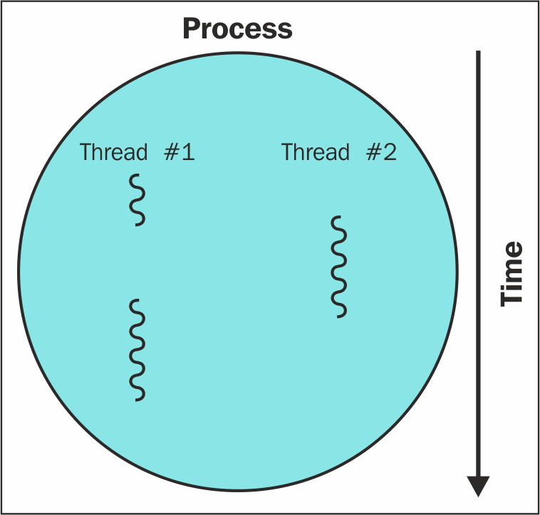
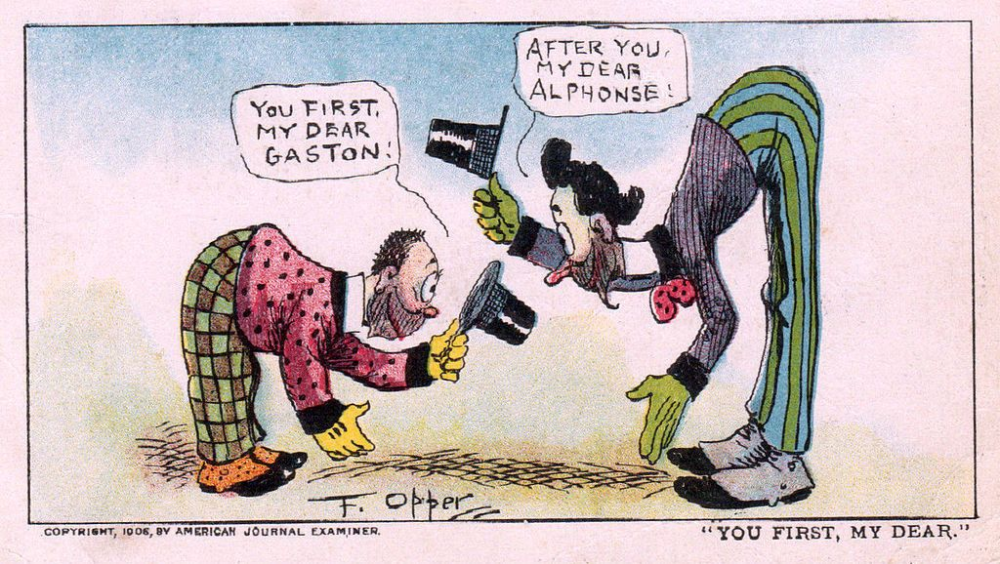

# Threads -  Wednesday Jan 27, 2021

## What is a thread?

- A thread is what's known as a _thread of execution_. It's the smallest set of instructions that can resolve. 
- They can indeed be thought of as a _lightweight task_. 
- Threads execute in something known as a _process_. A process is what you would consider a computer application or program.

  


## Code can be blocking and non-blocking

- Blocking code is any code that prevents further code from executing.
- Threads can execute blocking code indefinitely, causing what's known as a _deadlock_.
- Deadlocked code will typically result from variables utilized between multiple thread; if states are in the process of being changed, then neither thread will resolve. Observe the following code:

    ```java
    public class Deadlock {
        static class Friend {
            private final String name;
    
            public String getName() {
                return name;
            }
    
            public Friend(String name) {
                this.name = name;
            }
    
            public synchronized void bow(Friend bower) {
                System.out.format("%s: %s has bowed to me! %n",
                        this.name, bower.getName());
                bower.bowBack(this);
            }
    
            public synchronized void bowBack(Friend bower) {
                System.out.format("%s: %s has bowed back to me! %n",
                        this.name, bower.getName());
            }
        }
    
        public static void main(String[] args) {
            final Friend alphonse = new Friend("Alphonse");
            final Friend gaston = new Friend("Gaston");
    
            new Thread(() -> alphonse.bow(gaston)).start();
            new Thread(() -> gaston.bow(alphonse)).start();
        }
    }
    ```

  Both Alphonse and Gaston are forever in a state of invoking `bow()` and can never resolve that method. Why? `bow()` is invoking `bowBack()` which accepts the other bower object as an argument. The problem is that the other bower object is also in their `bow()` method and is also anticipating a bower. Neither bower can be accepted into the method due to how threads with synchronized codes work. Thus, this code is deadlocked and will run indefinitely.
<br></br>

  
  > _The ever courteous Alphonse and Gaston humorously deadlocked_
